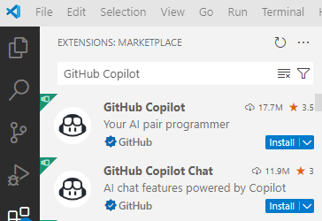
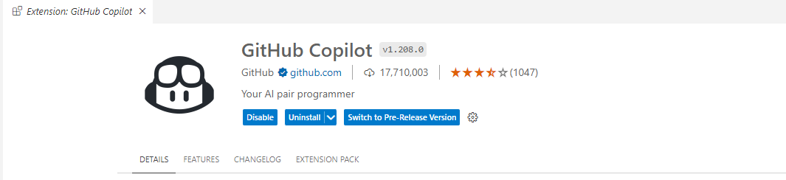

# Introduction to GitHub Copilot

In this module, we'll talk about the features and capabilities of GitHub Copilot. We'll review what GitHub Copilot is, including:

- The benefits of GitHub Copilot
- Different GitHub Copilot account types
- Different features of GitHub Copilot
- The limitations of GitHub Copilot.

We'll also go through how we can install GitHub Copilot extensions for Visual Studio Code, examine the different features provided by GitHub Copilot and the GitHub Copilot Chat extensions, and demonstrate how we can configure the GitHub Copilot extensions in Visual Studio Code.

## What is GitHub Copilot?

GitHub Copilot is an AI pair programmer that helps you write code faster with less effort. Copilot works with you directly in your IDE or code editor, which helps integrate it within your workflow. It provides intelligent code suggestions and completions based on the context of your code.

GitHub Copilot supports multiple programming languages and frameworks, and it works directly within your code editor. GitHub Copilot can provide suggestions and completions as you write code, which can range from a single line of code, to entire classes.

GitHub Copilot can help you focus on higher-level design and problem solving, saving us time from getting bogged down in the details of implementation.

## What is GitHub Copilot Chat?

GitHub Copilot Chat is a chat interface that lets you interact with GitHub Copilot. You can use it to ask questions related to the code your working on, and receive answers within GitHub.com, and supported code editors.

GitHub Copilot Chat can also provide explanations for selected code snippets, helping you to understand code syntax, programming concepts, debugging etc. without you having to navigate to documentation or waste time searching for answers online.

It can also generate documentation for you, either on selected lines of code, or your entire workspace. It can generate unit tests for you, and it can provide suggestions for refactoring your code and fixing common issues.

## GitHub Copilot account types

GitHub Copilot has different account types for organizations, and an offering for individual developers. All of these account types have code completions and chat assistance. The difference between individual and organization offerings come down to licence management, policy management and IP indemnity.

### GitHub Copilot Individual

- Free for verified students, teachers and maintainers of open source projects on GitHub.
- Includes features like code completions, chat in IDE and mobile, and security vulnerabilities filter.
- Focused on making developers more productive.
- Can use a 30-day free trial. Requires paid subscription after that.

### GitHub Copilot Business

- Allows you to control who can use GitHub Copilot in your company.
- Once you give access to an organization, your admins can then give access to individuals and teams.
- With Business, GitHub Copilot is open to every developer, team and organization, and enterprise.
- Features include code completions, chat in IDE and mobile, security vulnerabilities, code referencing, public code filter, IP indemnity, and enterprise-grade security, safety and privacy.

### GitHub Copilot Enterprise

- Available for organizations through GitHub Enterprise Cloud
- Helps developer teams get up to speed quickly, enabling them to search through and build documentation, get suggestions based on internal and private code, and quickly review pull requests.
- The difference between Business and Enterprise is that Enterprise includes an extra layer of customization for organizations.
- It's also integrated into GitHub.com as a chat interface, allowing developers to ask questions about code within GitHub.com.
- Enterprise can index an organization's codebase for a deeper understanding of their code, providing tailored suggestions and access to private, fine-tuned custom models for code completion.

## Features of GitHub Copilot

GitHub Copilot provides a range of features, including:

- Code Completion (code suggestions as you type).
- Chat interactions (Ask Copilot to help you with your code).
- Pull Request Summaries (**Copilot Enterprise only**) 
- Knowledge bases (**Copilot Enterprise only**)
- Copilot in the CLI (Use Copilot from the command line to generate code snippets and more)

## Limitations of GitHub Copilot Chat

GitHub Copilot Chat does have limitations. Depending on your codebase, the prompts you use etc/ you may experience different levels of performance when using Chat. Here's some limitations and how they apply to Chat.

**Limited scope**

Copilot Chat is trained on a large amount of code, but it's still limited. It all depends on the code structure and programming language used.

For each programming language, the quality of suggestions you get depends on the volume of training data for that language. Also, Copilot Chat can only suggest code based on the context of the code being written, so it may not be able to identify larger architecture issues or designs.

**Potential Biases**

Copilot is trained on existing code repositories that could contain errors, which can be included in the training data. Copilot Chat may also be biased towards certain programming languages or coding styles, which can lead to suboptimal or incomplete code suggestions.

**Security risks**

Copilot Chat generates code based on the context of code being written, which can potentially expose sensitive information or vulnerability if you're not careful. Be careful when using Copilot Chat to generate code, and review and test the code!

**Matches with public code**

Copilot Chat generates code in a probabilistic way, which means that the code it produces can have the potential to match code that was used in the training set.

Copilot Chat uses filters that block matches with public code on GitHub repositories, but you should still be careful. Use testing, IP scanning and check for security vulnerabilities before you push the code into production.

**Inaccurate code**

Copilot Chat can generate code that appears to be valid, but isn't. It may not be syntactically correct, or it may not match the intent of our prompts. You should review and test the generated code as a precaution.

**Inaccurate responses to non-coding topics**

Copilot Chat is meant for coding questions. If you ask it a non-coding related question, it won't always be accurate or helpful.

## Exercise: Installing GitHub Copilot extensions in Visual Studio Code

Let's start by installing the GitHub Copilot extensions we need on Visual Studio Code! You'll need a Copilot Subscription before we can get started with this, so you can use either a **personal account** or get it as a member of your **organization**.

We'll need to install the following extensions in Visual Studio Code:

- **GitHub Copilot**
- **GitHub Copilot Chat**

When we install the GitHub Copilot extension, the Chat extension will also be installed.

Follow these steps to install the GitHub Copilot extension on Visual Studio Code:

1. Open Visual Studio Code

2. Select **Extensions** from the left hand menu.

3. In the text box, type **GitHub Copilot** and then press enter.

4. In the filtered items, select GitHub Copilot extension that's authored by GitHub.

5. Select install.

6. You may need to authorize GitHub to work with Visual Studio Code. If you've done this before, you don't need to do anything.

- If you haven't done this before, Visual Studio Code will prompt you to sign in to GitHub.
- If you don't review a prompt, there should be a bell icon on the far right of Visual Studio Code's bottom panel.

7. To authorize GitHub with Visual Studio Code, select **Authorize Visual Studio Code**.

8. A dialog box will open, and you can confirm authorization in Visual Studio Code by selecting **Open**.

## Exercise: Installing GitHub Copilot extensions in Visual Studio 2022

Depending on the version of Visual Studio 2022 you're using, the way you install the required extensions differs slightly.

**Get GitHub Copilot for Visual Studio 2022 version 17.10 or later**

Both GitHub Copilot and GitHub Copilot Chat are available to install as a single extension that combines both Copilot and Copilot Chat into one package.

It is usually installed by default when you install any workload. If you chose to exclude it, or didn't install it, open up Visual Studio Installer, and modify your Visual Studio 2022 installation. Look for the **GitHub Copilot** component.

**Get GitHub Copilot for Visual Studio 2022 version 17.8 or 17.9**

In Visual Studio 2022 versions 17.8 to 17.9, GitHub Copilot and GitHub Copilot Chat are available to install as two separate extensions. Installing GitHub Copilot extension is a prerequisite to installing GitHub Copilot Chat.

**Install GitHub Copilot**

You can get the **GitHub Copilot extension** in one of the following ways:

- Install the GitHub Copilot extension using the [Visual Studio Installer]() (**recommended**)
- Install using the [Extension Manager](https://learn.microsoft.com/en-us/visualstudio/ide/visual-studio-github-copilot-install-and-states?view=vs-2022#install-using-the-manage-extensions-dialog-box)
- Install directly from Visual Studio Marketplace: [GitHub Copilot on Marketplace](https://marketplace.visualstudio.com/items?itemName=GitHub.copilotvs)

**Install GitHub Copilot Chat**

You can get the **GitHub Copilot Chat extension** in one of the following ways:

Install using the [Extension Manager](https://learn.microsoft.com/en-us/visualstudio/ide/visual-studio-github-copilot-install-and-states?view=vs-2022#install-using-the-manage-extensions-dialog-box)
Install directly from Visual Studio Marketplace: [GitHub Copilot Chat on Marketplace](https://aka.ms/VSXGHCopilot)

**Install using the Visual Studio Installer**

1. Launch the Visual Studio Installer.
2. Select the installation of Visual Studio you want to modify, and then select Modify.
3. Select any workload, for example, .NET desktop development.
4. Select GitHub Copilot from the list of Optional components, and then select Modify to install the extension.

*In versions 17.9 or earlier, you'll use the Manage Extensions dialog to manage updates to the GitHub Copilot extension.*

**Install using the Manage Extensions dialog box**

1. Open Visual Studio.
2. On the menu bar, select **Extensions** > **Manage Extensions**.
3. In the Search box, enter "GitHub Copilot" or "GitHub Copilot Chat".
4. Select the extension, and then select the **Download** button.
5. Restart Visual Studio to complete the installation process.

## Managing the state of Copilot

To ensure that Copilot has been configured properly, you can manage the state of Copilot within your IDE. 

### Visual Studio Code

To check if Copilot is active, look for the GitHub Copilot icon in the status bar, which indicates that GitHub Copilot is active.

Select the GitHub Copilot icon to open the Copilot status. The GitHub Copilot status should show **Ready**.

### Visual Studio 2022

With Visual Studio 2022 version 17.10, you should see a Copilot status icon in the upper-right corner of your IDE. *In version 17.8 and 17.9, this is at the bottom panel of Visual Studio*.

**Copilot is active**

If you're signed into Visual Studio with a GitHub account that has a Copilot licence, you should see the following status, along with the ability to open the Chat window:

**Copilot is inactive**

If you're not signed into Visual Studio with a GitHub account that has an active Copilot subscription, you can select **Add GitHub Account with a Copilot Subscription** in the dropdown to sign in.

Once you're signed in, the status should update to active. If Copilot is inactive, the signed in GitHub account credentials may need to be refreshed. Select **Refresh your GitHub credentials** from the dropdown to refresh your GitHub account and sign in again.

If you're still having issues, contact your IT administrator team for help.

**Copilot is unavailable**

If you've installed Copilot, but it's unavailable for use, it may be due to the following:

- Network connectivity issues.
- Server-side technical problems.
- Expired service plan.

To resolve these issues, select **Copilot is unreachable** in the dropdown menu to open the **Troubleshooting** page on diagnosing and resolving common network errors with GitHub Copilot.