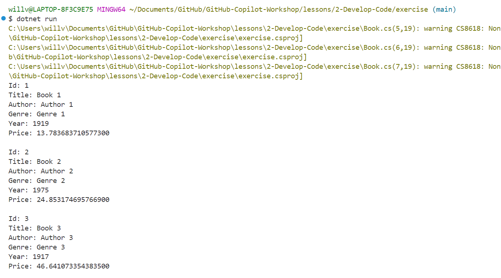

# Lesson 2: Develop code features using GitHub Copilot

GitHub Copilot can help us develop code more efficiently and accurately. It generates autocompletion suggestions as you enter code in the editor, and it can also generate suggestions based on code comments containing natural language text.

The GitHub Copilot Chat extension in Visual Studio Code generates code suggestions based on chat interactions and your codebase, as well as supporting smart actions that enable you to complete certain tasks without having to write prompts.

In Visual Studio Code, you have access to the following GitHub Copilot and GitHub Copilot Chat features:

- **Code line completions**: Use code line completions to write code more efficiently.
- **Inline chat**: Start an inline chat conversation directly from the editor for help while you're coding.
- **Chat view**: Open an AI assistant on the side that can help you at any time.
- **Quick Chat**: Ask a quick question and get back into what you're doing.
- **Smart actions**: Run smart actions to complete certain tasks without even having to write a prompt.

## Generate code using code line completions

GitHub Copilot generates code line completions as you enter code. It does this using code that's already in your application to provide Copilot with context.

If you're satisfied with the suggestion, press the **Tab** key or select **Accept**. Autocompletions save you time and help you to write code accurately by supplying names of variables and other code elements.

GitHub Copilot also generates code line completion suggestions from code comments. For example, you can describe a method that you want to create, and Copilot will generate a suggestion for the method signature and implementation.

This will also use your existing code as context, along with the comment that you provide.

### Exercise 1: Generating code using code line completions

In the [exercise](../2-Develop-Code/exercise/) folder for this chapter, you have a simple C# console application that we'll use to build an app that displays information about books. Let's take a look at the [Book.cs](./exercise/Book.cs) file.

This will be a class that represents information about a Book. As it's currently empty, we'll want to write a comment that tells GitHub Copilot to generate a class for us based on the information we provide it in the comments. At the top of the ```Book.cs``` file, write the following comment (or come up with your own!):

```csharp
// public class Book. Include the following fields: Id, Title, Author, Genre, Year, and Price. 
// Each field should have a public get and set method.
```

GitHub Copilot will generate one or more lines of code based on your comment, so when I wrote the above comment, I got the following:

```csharp
public class Book
{
    public int Id { get; set; }
    public string Title { get; set; }
    public string Author { get; set; }
    public string Genre { get; set; }
    public int Year { get; set; }
    public decimal Price { get; set; }
}
```

GitHub Copilot can generate more than one suggestion. To cycle through these, we can select the left ```<``` or right ```>``` arrows next to the **Accept** button. This allows us to review and select the suggestion that best fits your needs.

If none of the suggestions are to your liking, you can open a new editor tab containing more suggestions by pressing **Ctrl + Enter** keys. This will open another tab that will contain more suggestions, like so:


As you can see, each suggestion is followed by a button that you can use to accept the suggestion, and the tab will automatically close once you accept that suggestion.

If all else fails, you can hit the **Esc** key to dismiss the suggestion and try again. You can also change your comment to provide GitHub Copilot more context.

Now let's explore how we can use GitHub Copilot to generate code as we type. Remember there's two ways that we can do this:

1. Start by entering a code line, and wait for GitHub Copilot to suggest code.
2. Enter a complete code line, press the **Enter** key, and then wait for Copilot to suggest code.

In the [Program.cs](./exercise/Program.cs) file, we have a main method, with two comments for methods that we'll implement. Let's start with the following comment:

```csharp
// Create a method called GenerateBookData that returns a list of generated book records. Assign random values to each field of your Book class and return the list
```

Type the following code, and GitHub Copilot should suggest some code as to how the method should be implemented, like so:


Again, if you don't like the suggestion you get, you can use **Ctrl + Enter** to open the suggestion tabs. Otherwise, press **Tab** to accept the suggestion.

Remember to always review what Copilot has given you! It can produce syntax errors. It can provide invalid data types. Have a go at refining the comments in your code, and changing the method signature to provide GitHub Copilot with more context to generate code that fits your needs.

## Generate code using GitHub Copilot Chat

GitHub Copilot Chat helps you create code using the chat interface and smart actions. We can use prompts to ask GitHub Copilot to create new methods, and Copilot will provide suggestions for one or more method signatures and implementations. We can then review these suggestions, and accept one to help us create an initial cut of our code more quickly and accurately.

This is particularly helpful when you need to develop code that implements resources that you're not familiar with (such as new libraries, frameworks and APIs).

The GitHub Copilot Chat extension for Visual Studio Code includes 3 chat interfaces:

1. The **Chat view** provides an AI assistant that's available to help you at any time.
2. A **Quick Chat** window can be used to ask a quick question and then get back into what you're doing.
3. The **inline chat** interface opens directly in the editor for contextual interactions while you're coding.

Providing GitHub Copilot with prompts or questions that include clear scope and intent improves the quality of generated responses. You can ask questions, provide context, and outline requirements in a conversational style, and GitHub Copilot uses that information to generate code suggestions.

To improve suggestions, we can clarify the context of our prompts using the following:

- **Chat participants**, such as ```@workspace``` or ```@terminal```. These help GitHub Copilot Chat understand the context of your question.
- **Slash commands**, such as ```/explain``` or ```/new```. These help Copilot Chat understand the intent or purpose of your question.
- **Chat variables**, such as ```#file``` or ```#editor```. These help Copilot Chat focus on something specific when considering the larger context of your question.

### Exercise 2: Generating code using GitHub Copilot Chat

Let's generate some code for our Book Library application using GitHub Copilot Chat. Head into the ```Program.cs``` file of the [exercise](./exercise/Program.cs) folder and look at the following comment:

```csharp
// Create a method that displays a list of books to the console.
```

We can generate this method using the inline chat. Position your cursor on the blank line below this comment and open the inline chat interface by pressing **Ctrl + I**. Enter the following prompt (or better yet, provide your own prompt!):

```
Create a static method that prints the details of a list of books to the console.
```

This is the output I got when I entered that prompt. Bear in mind that Copilot will show something different to you, because it's working off your codebase as context.


As long as your prompt is clear and specific, Copilot should provide a suggestion that's useful to you. As always, you can reject the suggestion, and provide a new prompt.

To accept the suggestion, click on the **Accept** button.

Now that you have your two methods, let's use the GitHub Copilot Chat view to implement these methods in our ```Main``` method. To open the Chat view in Visual Studio Code, you can press **Ctrl + Alt + I**, or select the Chat icon from the Activity Bar.


Let's test our program to make sure it works! To do this, open up a terminal (In VS Code, you can use the **Ctrl + Shift + `** hotkey to do this) and run the following:

```dotnet
dotnet run
```

If your program compiles, you should see a list of books being printed to the console, like so:



Congratulations! You've just used GitHub Copilot Chat features to create your library application! Granted it's not the most sophisticated application, but you've learnt how you can use GitHub Copilot to generate code for you based on inline comments within your code, prompts that you've given the inline chat feature, and also via the chat view in Visual Studio Code.

Let's take a look at some best practices for GitHub Copilot before tackling the challenge!

# GitHub Copilot Best practices 

- **Get the most out of Copilot inline suggestions**

Copilot will automatically provide suggestions to help you code more efficiently. It'll provide better suggestion when you follow certain actions and behaviors.

- **Provide context to Copilot**

Copilot works best when it has the right context to know what you're doing and what you need help with.

- **Open the right file**

For code completions, Copilot will look at the current and open files in your editor to analyze the context and create the right suggestions. Having the right file open while using Copilot will help set this context and lets Copilot see a bigger picture of your project.

- **Provide the right top level comment**

The right top level comment in your code files will help Copilot understand the overall context of the code that you're creating. This is similar to providing the high-level context to a problem that you're encountering to a co-worker.

- **Use appropriate includes and references**

It's best to manually set the includes or module references that you need in your code. Copilot can make suggestions, but you'll have a better idea of what dependencies you need to include. This helps Copilot know what frameworks, libraries and their versions you'd like to use when crafting suggestions.

- **Use meaningful function/method names**

Meaningful function or method names will help Copilot provide a body of code that you want to implement. Method names like ```fetchData()``` won't mean much if you don't provide meaningful context of what the function will do.

- **Use specific and well-scoped function comments**

Bear in mind that function names can only be so descriptive without being too long. Use function comments to help fill in details that Copilot might need to know.

- **Use sample code**

One trick that you can use is to copy and past desirable code samples into an open editor tab. This should represent the code that you want Copilot to emulate, and help Copilot generate suggestions that match the language and tasks you want to emulate.

Once Copilot provides a suggestion, you can delete the sample code. This helps *train* Copilot to provide suggestions relevant to your context.

- **Be consistent and keep the quality bar high**

Since Copilot uses your code as context to generate suggestions, you need to be mindful of *garbage in, garbage out*. You can temporarily disable Copilot suggestions while you're writing some psuedocode, and then enable it again to improve on your code.

- **Use chat participants, slash commands, and chat variables**

Chat participants are designed to collect extra context either about a code base or a specific domain or technology. When you speficiy the appropriate participant, Copilot Chat can find and provide better information to send to Copilot.

Slash commands help Copilot Chat understand your intent when you ask a question. By letting Copilot Chat know what you're trying to do, it can tune its reply to your task, and provide helpful commands, settings, and code snippets.

Chat participants, such as ```@workspace``` or ```@vscode``` can contribute chat variables that provide domain-specific context. You can reference a chat variable in your chat prompt by using the ```#``` symbol. You can use chat variables to make your context more specific in your prompts.

- **Iterate on your solution**

With Copilot Chat, you aren't limited to just the first response. You can iterate and prompt Copilot to improve the solution.

# Challenge Time - Develop features for the Todo App using GitHub Copilot

It's time for our first challenge! In the [challenge code](../../challenge-code/) folder,

In this challenge, your task is to use GitHub Copilot to implement some new features for the Todo application. This is your change to be creative! Use both code line completions and GitHub Copilot Chat to implement new features, and be as creative as possible!

With these challenges, there's no *right* answer - It's a chance to apply the skills you've learnt in the lesson and be a little creative in how you implement your solution. Here's some pointers for inspiration that you can use for the challenge:

- Take a look at the [TodoItem](../../challenge-code/api/Todoly.Api/Todoly.Api/TodoItem.cs) model. Can you use inline code completions to expand the model? What else should be included in the model?
- Take a look at the endpoints for the API. Is this API complete? Are there any endpoints missing? What else should be in here?

Grab a friend, join a team or a group, and start thinking about how you can use Copilot to implement some new features in your Todo application!

**WANT TO WIN SOME SWAG?!**

First team to demo their solution gets a prize!