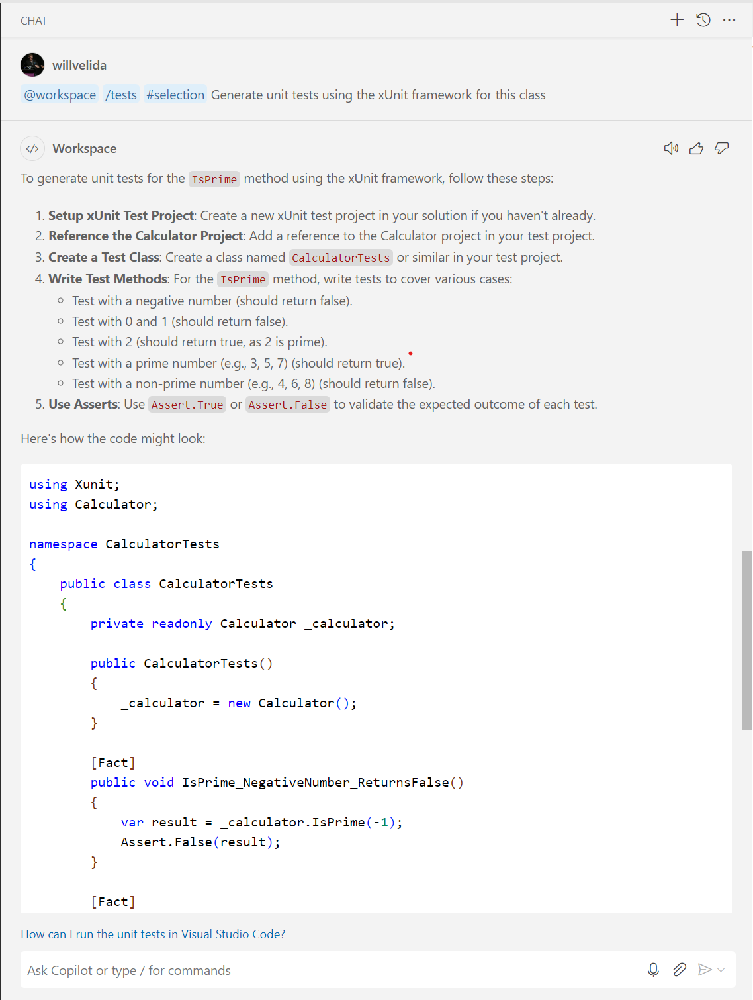
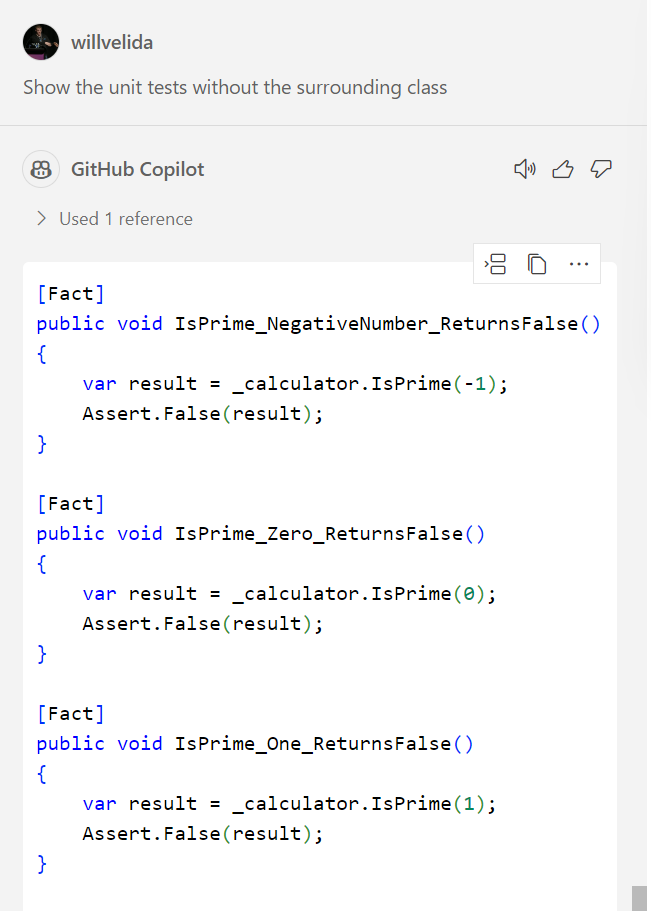
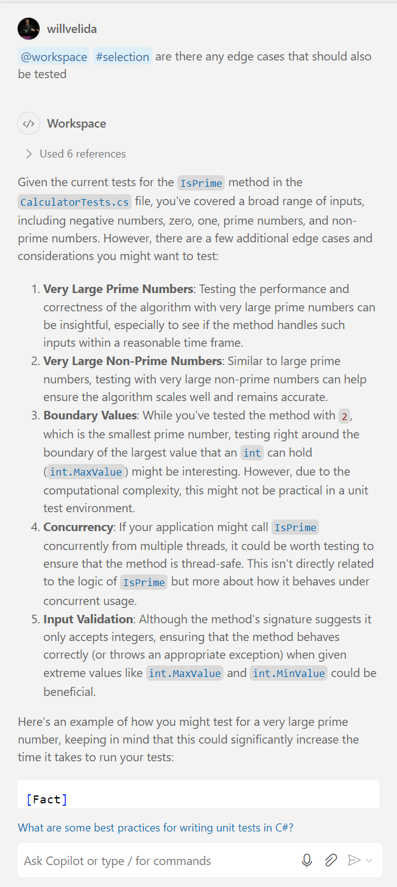

# Lesson 3: Developing unit tests using GitHub Copilot

Testing is crucial to developing quality software, as it ensures that the functionality that we implement in our applications work as intended.

In this lesson, we're going to learn how we can use GitHub Copilot and GitHub Copilot Chat in Visual Studio Code to generate unit tests, using the Chat view, inline chat and code completions that we learnt in the previous lesson.

Creating unit tests manually can be time-consuming and error-prone. There's edge cases and boundary conditions that we need to be mindful of, and GitHub Copilot can help identify these for us.

By the end of this lesson, you'll know how to:

- Create unit tests in VS Code using GitHub Copilot and GitHub Copilot Chat.
- Create unit tests for edge cases and boundary conditions using GitHub Copilot Chat

## GitHub Copilot and Unit Testing

GitHub Copilot Chat can be used to suggest unit tests for our code. When we specify a method signature and body, GitHub Copilot Chat can suggest test cases that cover input parameters and expected outputs. Once we have a few test cases, we can use GitHub Copilot to generate code suggestions for additional test cases.

Using code line completions as we have done when generating code, we can generate unit tests and reduce the repetitive process of writing unit tests, and ensure that our code is thoroughly tested.

Remember, GitHub Copilot Chat will use your code as context to suggest assertions to ensure that the function you want to test works correctly. Copilot Chat can also suggest test cases for error handling, null values, or unexpected input types.

As always, the generated code may not cover ALL possible scenarios. You'll need to manually test and perform code reviews to ensure that the generated code does what you need it to do. It's a Copilot after all....

## Exercise: Adding unit tests to our Calculator Library

In the [exercise](./exercise/) folder, we have a C# class library that represents a calculator. In this exercise, we will add some unit tests for our [Calculator.cs](./exercise/Calculator/Calculator.cs) file using the xUnit test framework.

*You may not have used xUnit before. If not, don't worry! We've made a deliberate choice to use it here, so we can get used to using GitHub Copilot to generate code in frameworks that may not be familiar to us.*

Open up the `Calculator.cs` file and then open up the GitHub Copilot Chat view (**Ctrl + Alt + I** in Visual Studio Code). In the Chat view, enter the following prompt:

```
@workspace /tests #selection Generate unit tests using the xUnit framework for this class
```

Let's break the prompt down:

- `@workspace`: 
- `/tests`:
- `#selection`

Take a minute to looks at the suggestion provided by GitHub Copilot. This is the response I got when I ran it:



In my case, I got a full blown class, along with some suggestions on how to setup the xUnit test project, how to reference the project, create a test class, write methods, and how those methods might look.

With the Chat view, we can add the suggested code into our test project. We can insert it where our cursor currently is, we can add a new file, or we can copy it to the clipboard and paste it where we want.

If we don't want to generate the whole class, we can refine our prompt like so:

```
Show the unit tests without the surrounding class
```

This will just show the unit test methods, which we can copy/paste, insert at the cursor or insert the snippet into a new file or the terminal.



In my case, GitHub Copilot Chat only generated unit tests for my `IsPrime()` method. Let's use inline chat to generate unit tests for one of my other methods.

*Since GitHub Copilot works on the context of your code, your output may be a little different. Feel free to use a method of your choice using the steps below.*

Open the `Calculator.cs` file and select a method that you want to generate unit tests for. I'm going to use the `Add()` method.

Highlight the method and open an inline chat session. Let's try to generate some unit tests for our `Add()` method with the following prompt:

```
Create some unit tests for this method using the xUnit framework
```

*Notice that I specified the testing framework that we're using? What happens when we remove this? Is the response from GitHub Copilot consistent? Or do we get random responses?*

Review the output from GitHub Copilot - What else can we do to improve the output? Let's say we're using the **Arrange, Act, and Assert** pattern in our unit tests, but Copilot hasn't generated code that follows this pattern, we can refine our prompt to generate unit tests that do follow this pattern. Here's an example:

```
Create some unit tests for this method using the xUnit framework that follow the Arrange, Act, and Assert Pattern
```

Now that we've created unit tests using the Chat view and inline chat, let's dive a bit deeper.

One of the advantages of using GitHub Copilot is that it can generate unit tests that test for edge cases. What are some of the common edge cases that you deal with? Some could include:

- File types (anyone ever used a .dat file before?)
- File size
- Race conditions

Let's take our `isPrime` method as an example. Let's ask Copilot if there are any edge cases we should be test for. Select the contents of the `CalculatorTests.cs` file, open up the Chat view and ask the following:

```
@workspace #selection are there any edge cases that should also be tested
```

This is the output that I got:



As part of the output, GitHub Copilot will provide some unit tests based on its recommendations. So in my response, I received the following:

```csharp
[Fact]
public void IsPrime_VeryLargePrimeNumber_ReturnsTrue()
{
    // This is the largest prime number less than int.MaxValue
    var result = _calculator.IsPrime(2147483647);
    Assert.True(result);
}
```

Experiment with the prompts and review your outputs. What other edge cases can you think of? Use your knowledge to refine your prompts, and let GitHub Copilot do the grunt work of writing your tests for you!

# Challenge: Add Unit Tests to your Todo Application

It's time for another challenge! You added features to your Todo application, but now we need to test them to make sure they work! Let's take what we've learnt in this lesson to do that!

Again, you have free reign to implement tests for your application the way you want to. You don't have to use xUnit, you don't even have to write tests for just C#, feel free to add some for the front-end too!

Here's some pointers for inspiration:

- How do we know that our endpoints behave as expected? We could use some tests for that.
- The front-end needs some attention too! If you're not an expert in React, we can use GitHub Copilot to explain how the front-end works, and how we can test it!
- What edge cases can you think of? Can Copilot help here?
- How do we run the tests?

Grab a friend, join a team or a group, and start thinking about how you can use Copilot to help accelerate the process of testing your Todo application!

**WANT TO WIN SOME SWAG?!**

We'll be asking people to demo their solutions at the end of the challenge with a chance to win some amazing Star Wars Lego! We'll get 3 people to demo their solution, so first come, first served....

Once the 3 entrants have demoed their solution, we'll be asking all of you to vote for the winner! In particular, we're interested in:

- What prompts did you use to generate your unit tests?
- What edge cases did you account for when generating your unit tests?