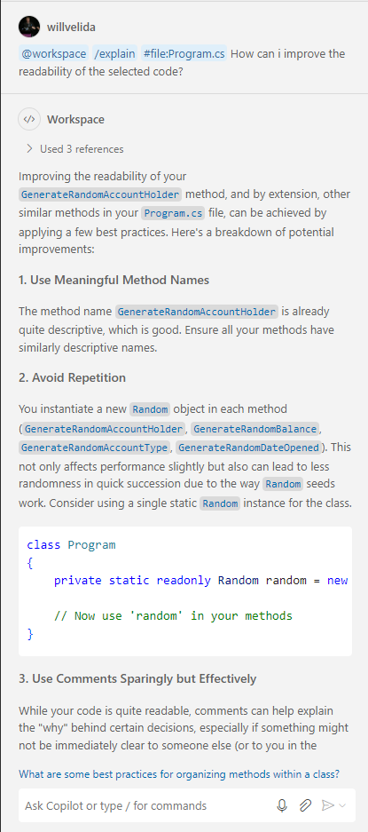

# Lesson 4: Improving our code using GitHub Copilot

In this lesson, we'll learn how we can use GitHub Copilot CHat to implement code improvements.

This includes improvements such as code quality, code reliability, code performance, and code security. This lesson will teach you how to craft prompts to GitHub Copilot that generate suggestions for specific improvement areas. We'll learn how GitHub Copilot can help us improve our code in the following ways:

- **Code quality**: Enhance the readability, maintainability, and efficiency of your code.
- **Code reliability**: Improve the robustness, error handling, and stability of your code.
- **Code performance**: Optimize the speed, memory usage, and efficiency of your code.
- **Code security**: Enhance the security, privacy, and protection of your code and data.

We'll go through a couple of exercises that show you how we can craft prompts that generate suggestions for specific improvement areas, as well as demonstrate how to implement code up suggestions, accelerate the development process, and improve the quality of our code.

By the end of this lesson, you'll know how to:

- Use GitHub Copilot to improve your code.
- Use GitHub Copilot Chat to increase the quality of your code.
- Improve code reliability and performance with GitHub Copilot Chat.
- Improve code security with GitHub Copilot Chat
- Use GitHub Copilot Chat to debug issues in our code.

## Improving our code 

The overall theme of this workshop is to remind you that GitHub Copilot is just a Copilot at the end of the day. **You are in the driving seat**. Without AI tools, improve our code requires time and experience:

- **Time**: Implementing improvements in our code can take a long time. We need to analyze the code, identify areas for improvement and then implement the changes. This can be time consuming, especially for large, complex, codebases. We're all under the pump when it comes to timelines, and more often than not, code improvements are left behind in favour of releases.
- **Experience**: GitHub Copilot makes coding easier, but we still have to know the fundamentals of software development, how our editor works, best practices etc. This experience helps us determine the quality of suggestions that GitHub Copilot provide.

With this in mind, let's take a look at the ways we can use GitHub Copilot to improve our code.

### Improving the quality of our code

GitHub Copilot can suggest improvements to our code, such as refactoring, suggesting design patterns, or enchancing our coding style. These suggestions can help us write code that is cleaner, maintainable, and follows best practice.

Here's some example prompts that you could use to improve the quality of your code:

- `Suggest refactoring updates to enhance the modularity of the Book class`
- `Provide design pattern suggestions to improve the internal structure of the BookService class`
- `Recommend code style enhancements to make the BookController class more readable`

### Improving the reliability of our code

GitHub Copilot can help us to make our code more reliable. This can include things such as better error handling, more robust input validation or enhanced exception handling. This helps us handle edge cases and unexpected conditions that we could potentially encounter more effectively.

Some prompts that you might use to improve code reliability could include:

- `Suggest better error handling strategies for the BookService class`
- `Improve input validation in the LoginForm class to prevent invalid input`
- `Enhance exception handling in the BookDbRepository class to handle exceptions more gracefully`

### Improving the performance of our code

We can use GitHub Copilot to optimize our code. Maybe we need to improve the performance of an algorithm, reduce the amount of memory used, or improve the execution of our code.

Some prompts that we can use to improve the performance of our code:

- `Optimize the sorting algorithm in the GetBookList method to improve performance`
- `How can I reduce the memory usage in the GetBookImage method to make it more efficient`

### Improving our code security

GitHub Copilot can also suggest improvements that make our code more secure. This is great when we need to think of data encryption, authentication, or preventing security vulnerabilities.

Some prompts that can help us write more secure code:

- `Show me how to implement secure authentication mechanisms in the LoginService class to prevent unauthorized access`
- `Implement exception handling in BookService that will prevent common security vulnerabilities`

### Exercise 1: Using GitHub Copilot Chat to improve our code

We use prompts to communicate our intent to GitHub Copilot. This requires us to have a clear understanding of what we want to achieve. Keep your prompts **concise, specific, and focused**.

Let's take a look at improving the quality of our code first. In the [exercise](./exercise/) folder, we have a console application that creates bank accounts, and simulates transfers between those accounts. Take a second to review the code, and try running it a couple of times to see how it works.

As developers, there's a couple of factors we should consider when working on code quality improvements:

1. **Readability** - How readable is our code? Improving the readability of our code can make it easier for developers to understand.
2. **Complexity** - Is our code too complex to be understood. Reducing the code complexity our our code makes it easier to understand, manage, and maintain.
3. **Modularity** - Breaking down our code into smaller, reusable modules can also make the code easier to manage and maintain.

What other factors can we associate with code quality? Have a think about it, and let's see how we can use these factors to help craft our prompts to GitHub Copilot.

**Some tips when crafting our prompts**

As we've learnt throughout this workshop, when we ask GitHub Copilot to perform a task for us, we should provide a clearly defined **context** and **intent**.

The **intent** of our prompt describes the goal that we want to achieve, while the **context** tells GitHub Copilot what resources to consider. With this is mind, use the following tips when developing your prompts:

- **Define the outer context that's scoped at a higher level than the code you want to update**. For example, if you want to refactor the `GenerateRandomAccountHolder()` method, you can specify the class or file that contains the method as the outer context, and the method will be your inner context.
- Use **Chat participants** and **chat variables** to help specify context. GitHub Copilot has both `#file` and `#selection` chat variables that you can use to identify the specific code you are focused on. You can also include the full workspace (`@workspace`) when needed.
- **The intent should be clear and specific, and specify the code quality aspect that you want to improve**. 

Heading back in our `Program.cs` file, let's think about some prompts that we can use to improve the readability, maintainability, and modularity of our code. These could include:

`@workspace /explain #file:Program.cs How can I improve the readability of the selected code?`

`@workspace /explain #file:Program.cs #selection How can I improve the maintainability of the selected code?`

`@workspace /explain #file:Program.cs How can I improve the modularity of the selected code?`

`#file:Program.cs #selection How can I refactor the selected code to improve modularity?`

`@workspace /explain #file:Program.cs What are some options for simplifying the selected code?`

*Extra credit: Can you think of any others? Feel free to play around with some prompts to see how GitHub Copilot responds!*

Let's use one of these prompts on the `GenerateRandomAccountHolder()` method. Highlight the method, open up the Chat view and enter the following prompt:

```
@workspace /explain #file:Program.cs How can I improve the readability of the selected code?
```

Take a moment to review the output from GitHub Copilot. In this example, we get some recommendations on using meaning full method names, avoiding repetition, using comments sparingly etc.



Make changes to the code based on the output that GitHub Copilot has suggested. What changes did you make? Does the code look more readable?

What about asking Copilot to improve the maintainability of our code? Let's highlight the `GenerateRandomAccountHolder()` method again, and ask the following question using the Chat view.

```
@workspace /explain #file:Program.cs How can I improve the maintainability of the selected code?
```

Review the output. As you can see from the example below, GitHub Copilot has given us some suggestions as to how to make this code more modular.


As part of the output, you should get a revised code output that shows you how you can implement the suggestions that GitHub Copilot has made. For example, the following code block has been included in the response we got from GitHub Copilot:

```csharp
// Assuming .NET 6 or later
public class AccountGenerator
{
    private static readonly string[] AccountHolderNames = {
        "John Smith", "Maria Garcia", "Mohammed Khan", "Sophie Dubois",
        "Liam Johnson", "Emma Martinez", "Noah Lee", "Olivia Kim",
        "William Chen", "Ava Wang", "James Brown", "Isabella Nguyen",
        "Benjamin Wilson", "Mia Li", "Lucas Anderson", "Charlotte Liu",
        "Alexander Taylor", "Amelia Patel", "Daniel Garcia", "Sophia Kim"
    };

    /// <summary>
    /// Generates a random account holder name from a predefined list.
    /// </summary>
    /// <returns>A randomly selected account holder name.</returns>
    public static string GenerateRandomAccountHolder()
    {
        return AccountHolderNames[Random.Shared.Next(AccountHolderNames.Length)];
    }
}
```

Finally, let's ask GitHub Copilot how we can make our code more modular. Enter the following prompt in the Chat view:

```
@workspace /explain #file:Program.cs How can I improve the modularity of the selected code?
```

As with our previous prompts, we should get some suggestions from GitHub Copilot on how we can make our code more modular, and some suggestions on how we can implement those improvements.


Let's turn our attention to using GitHub Copilot to improve the **reliability** and **performance** of our code.

It's important to note here that suggestions from GitHub Copilot **don't always represent best practice for improving reliability and performance!** You as the developer need to use your judgement and knowledge to evaluate the suggestions that GitHub Copilot provides.

**GitHub Copilot does not, and will not, replace the need for thorough code reviews and testing! (As much as we would like it to....)**

With this in mind, let's think about some of the prompts that we can use to generate suggestions for improving the reliability of our code. You can use prompts to direct GitHub Copilot to generate suggestions that improve exception handling, reduce unexpected issues, and improve test coverage.

Use a combination of specific and general prompts to help you identify areas that need improvement and implement the necessary changes.

Here are some to get you started:

`@workspace /explain #file:BankAccount.cs How can I improve exception handling the selected code?`

`@workspace /explain #file:BankAccount.cs How can I reduce unexpected issues for the selected code?`

`@workspace /explain #file:BankAccount.cs How can I improve unit test support for the selected code?`

`@workspace /explain #file:Program.cs How can I improve performance with asynchronous tasks or methods in the selected code?`

`@workspace /explain #file:Program.cs How can I improve the efficiency of algorithms or data structures for the selected code?`

Let's work with the [`BankAccount.cs`](./exercise/BankAccount/BankAccount.cs) file. Highlight the code in the file, open up Chat view and then enter the following prompt:

```
@workspace /explain #file:BankAccount.cs How can I improve exception handling the selected code?
```

Review the output from GitHub Copilot. Copilot will provide some suggestions on how to improve exception handling within the `BankAccount.cs` file, and provide steps on how to implement these changes.


After you have implemented the changes, experiment with some of the suggested prompts above. What recommendations does Copilot provide? Are there some that you can implement? Does something not look right?

Now let's try a prompt that focuses on improving the performance of our code. To do this, open up the [`Program.cs`](./exercise/BankAccount/Program.cs) file, then open up the Chat view and enter the following prompt:

```
@workspace /explain #file:Program.cs How can I improve performance with asynchronous tasks or methods in the selected code?
```

GitHub Copilot should once again, provide some suggestions on how we can improve the performance of our code.


Finally, let's see how we can use GitHub Copilot to improve our code security. Again, suggestions from GitHub Copilot **do not always represent the best practices or comprehensive solutions to develop secure code**. As developers, you still need to use your judgement and expertise to implement secure code, as well as work alongside your security teams to ensure that the code you write doesn't introduce any vulnerabilities to your organization.

Think of the code security processes that exist within your organization. What comes to mind? How do code security reviews currently work in your team? How do you analyze code vulnerabilities?

With these questions in mind, can we incorporate the answers to these questions within the prompts that we give to GitHub Copilot?

Here's some that we could use as examples:

`@workspace /explain #file:BankAccount.cs How can I implement authentication in the selected code?`

`@workspace /explain #file:BankAccount.cs How can I protect sensitive data in the selected code?`

`@workspace /explain #file:BankAccount.cs How can I implement logging of suspicious account activities of the selected code?`

`@workspace /explain #file:Program.cs How can I improve the security of the selected code?`

Let's open up the [`BankAccount.cs`](./exercise/BankAccount/BankAccount.cs) file, select all the content, open up Chat view, and enter the follow prompt:

```
@workspace /explain #file:BankAccount.cs How can I protect sensitive data in the selected code?
```

Take a minute to observe the output from GitHub Copilot. You should see some recommendations from Copilot on how you can make your code more secure, and how you can implement those suggestions with some code samples.


Remember, the best way to secure your code depends on **your specific use case and requirements**. Copilot is there to help you, but not do the job of making your code more secure for you!

Now that we know how we can use GitHub Copilot to make improvements to our code, let's apply what we've learnt to our next challenge!

# Challenge: Improve your code using GitHub Copilot Chat

It's now time to apply what we've learnt in this lesson to your own Todo application. We've used GitHub Copilot to create some new features, and we've also generated some unit tests to ensure that our code works as expected.

You're now going to use GitHub Copilot to improve our code. Again, how and what you improve is up to you, but here are some suggestions to get you started:

- How secure is your code? Maybe that frontend could use some authentication? How about the backend?
- How are you managing user input? Can you enter anything for the name of your todo tasks? Maybe that can be improved?
- How reliable is your code? Are there any edge cases you can think of that GitHub Copilot can help you out with?

**Want to win some SWAG?!!!!**

- First pair/team/group to demo their work gets a prize!