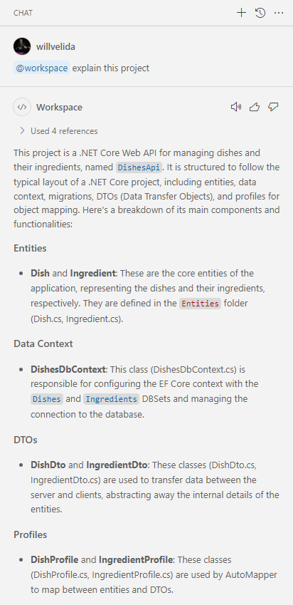
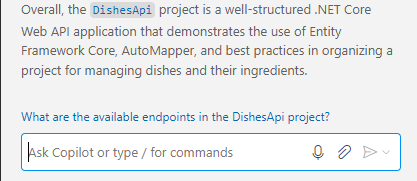
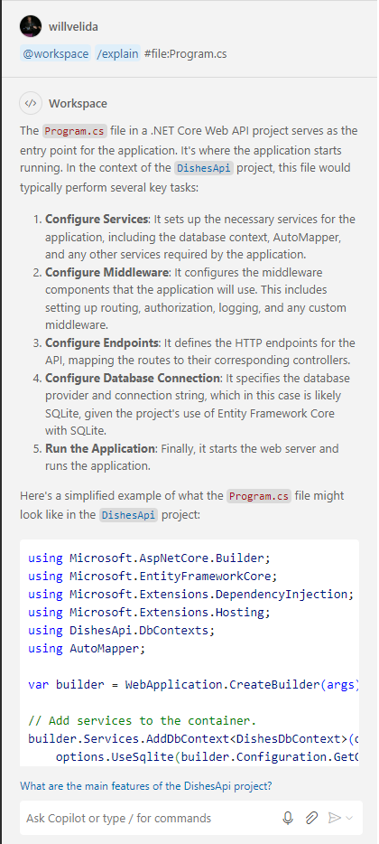
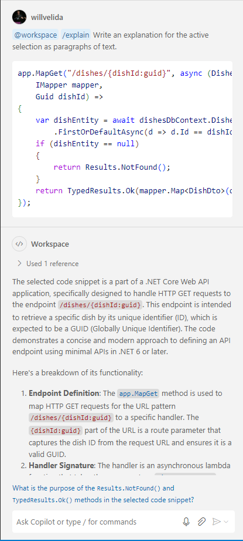
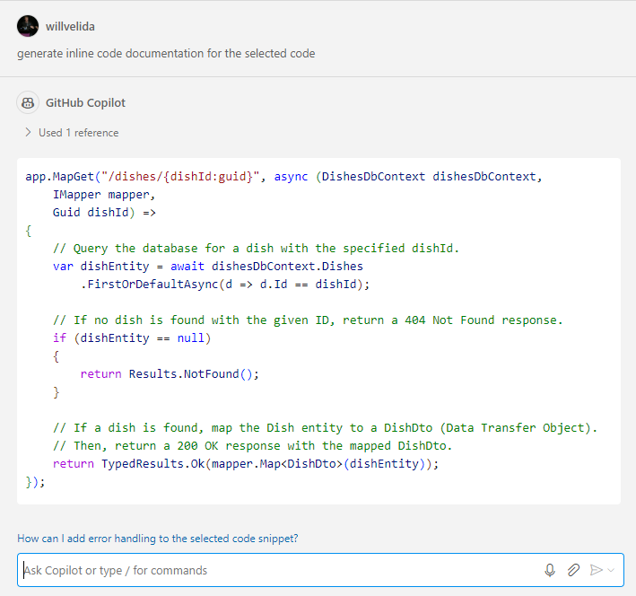
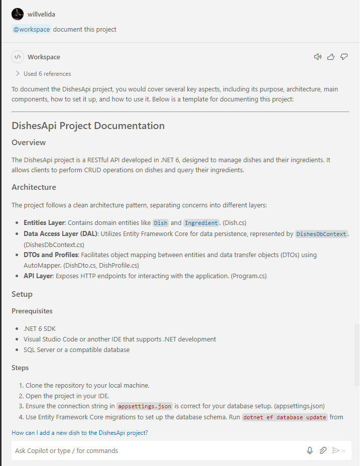
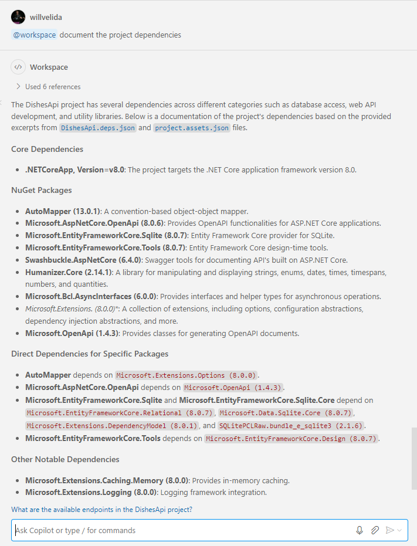
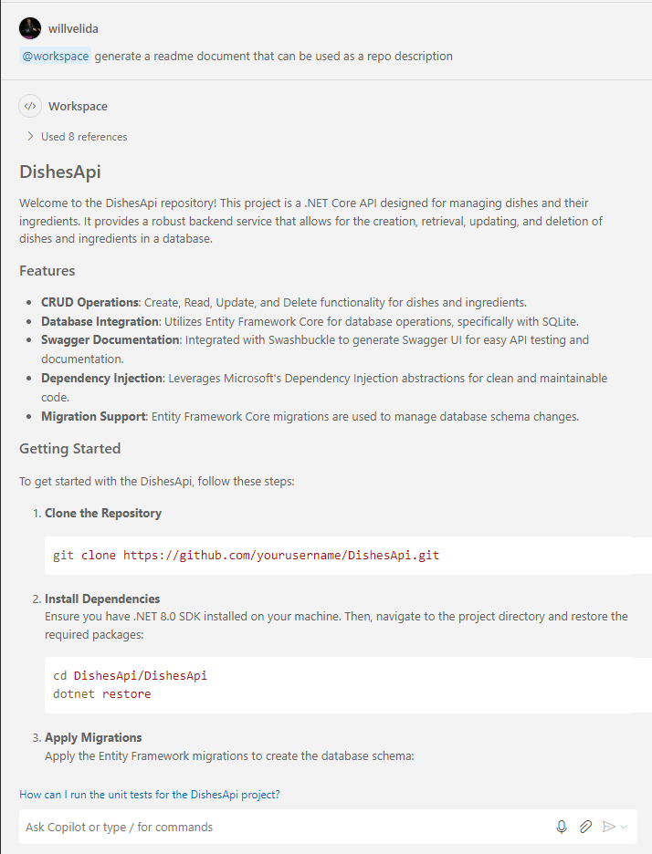

# Lesson 5: Generating documentation using GitHub Copilot

In this module, we'll learn how we can explain and document our code using the GitHub Copilot Chat extension in Visual Studio Code. We'll cover:

- Reviewing the features of GitHub Copilot Chat that can be used to explain code and generate documentation.
- Using GitHub Copilot Chat to generate explanations for complex or unfamiliar code.
- Using GitHub Copilot Chat to generate project documentation.
- Using GitHub Copilot Chat to generate inline code documentation and pull request summaries.
- Completing a "code documentation" challenge activity and reviewing a possible solution.

By the end of this lesson, you'll know how to use GitHub Copilot Chat to explain complex or unfamiliar code, generate documentation, and increase our efficiency as developers.

## Generate explanations using GitHub Copilot Chat

Explanations are great when we encounter code that is complex or unfamiliar and we need to understand how it works. This could include complex algorithms, regular expressions etc.

Copilot Chat helps explain selected code by generating natural language descriptions of the functionality and purpose of selected code. There's several ways to generate explanations of selected code using GitHub Copilot Chat:

- You can use inline chat and use ```/explain``` in your prompt.
- You can use the ```Explain This``` smart action.
- You can open the Chat view and use ```/explain #selection``` in your prompt.

You can also use explanations that address a broader scope. You can use ```@workspace``` to generate an explanation for the entire workspace. Responses can include a summary of the project, its purpose, and other information that's relevant. You can also generate explanations of a specific project file in the workspace by using the ```#file``` chat variable to specify a filename.

Here's some examples of questions that you can ask Copilot Chat to generate explanations:

- Chat view: ```@workspace Explain this project```
- Chat view: ```@workspace /explain Explain the dependencies of this project```
- Chat view: ```@workspace /explain #file:program.cs Explain how this file is used in the project```
- Inline chat: ```/explain #selection Explain how this method works```
- Inline chat: ```/explain Explain this code block```

## Generate documentation using GitHub Copilot Chat

Documentation is typically used for the following purposes:

- **Inline documentation** is used to describe the contents of a code file. It's intended for developers and testers who work on the codebase.
- **External project documentation** is used to provide an overview of the project. This documentation is intended for executive stakeholders, project managers, and end users. Developers and tester can also benefit from external documentation.

Let's explore how we can use GitHub Copilot Chat to help us write both types of documentation!

### Generate inline documentation

Good inline documentation improves the readability and maintainability of our code. GitHub Copilot can generate inline documentation quickly and accurately, performing tasks such as documenting classes and methods, to help us save time.

To generate inline documentation using GitHub Copilot, we have the following options:

- We can construct natural language prompts to generate the desired documentation.
- We can enter the ```/doc``` command in the inline chat to generate comments that describe the selected code.
- We can use the ```Generate Docs``` smart action to generate comments that describe the selected code.

### Generate external project documentation

You can use the ```@workspace``` chat participant followed by a natural language description to generate documentation for an entire workspace. By generating documentation for the workspace, you can create a high-level overview that helps other developers understand the project and its purpose.

Here's some examples we can use to generate documentation:

```@workspace Generate a project summary that can be used at an executive briefing```

```@workspace Generate a README markdown document that can be used as a repo description```

# IMPORTANT! Review the output from GitHub Copilot Chat and ensure it's correct!

GitHub Copilot is good at generating explanations and documentation based on the code that you provide and the questions that you ask.

That said, it's important that you review and correct the generated output to ensure that it's complete and accurate.

When reviewing the output, consider the following:

- Check the generated explanations and documentation for accuracy and completeness.
- Verify that the generated output aligns with the code you provided and the questions you asked.
- For documentation, correct any errors or inaccuracies in the generated output to ensure that it accurately reflects the code's behavior and purpose.
- Add additional information or context to the generated output to provide more comprehensive documentation.

# Exercise: Adding documentation to an ASP.NET Minimal API

In the [exercise](./exercise/) folder for this section, there's a ASP.NET minimal API project that displays information about dishes and their ingredients. We could learn about this project by taking a look at the files, but let's use GitHub Copilot to speed up this process.

Let's start by using GitHub Copilot chat to explain the project for us. Open up a Chat view in Visual Studio Code and enter the following command:

```
@workspace Explain this project
```

GitHub Copilot Chat will generate an explanation of the API project like so:

*Remember that the response you see here below may be a little different to what you see!*



You may have notice that GitHub Copilot Chat has suggested a follow-up question which you can use to ask further questions:



GitHub Copilot Chat builds history of your conversation, which helps it to understand what you're interested in. As this chat history builds up, the AI model learns from your interactions and provides more relevant follow-up questions. With this in mind, **avoid asking GitHub Copilot random questions in your chat history!** This way, GitHub Copilot can provide more relevant suggestions.

Let's use GitHub Copilot Chat to get a better understanding of a particular file. Enter the following prompt:

```
@workspace /explain #file:Program.cs
```

Take a minute to review the response in the Chat view:



Notice that Copilot Chat has generated a detailed explanation of the `Program.cs` file, which includes the purpose of the file, the structure, and key components.

With the chat view, it's important to note that **GitHub Copilot Chat maintains a history of your chat conversation!** Ask you continue to ask questions, it will refine the responses it provides.

The **context** of your questions will influence the responses you get from GitHub Copilot Chat. This helps Copilot to provide more accurate and relevant responses.

Now let's take a look at how we can get GitHub Copilot to explain selected lines of code. We all encounter code that's difficult to understand, so we can use GitHub Copilot to generate explanations of code that's selected.

Using the `Program.cs` file, let's highlight the `app.MapGet()` method that selects a dish by its Id. We can then right-click on the selected code, select **Copilot**, and then select **Explain This** from the menu.

Take a minute to review the response in the Chat view:



Notice that GitHub Copilot has generated a detailed explanation that incudes information about the selected code lines, their purpose, and how they work.

Now, let's take a look at how we can generate **inline code documentation by using GitHub Copilot Chat**. Copilot Chat can help us to document our code by generating inline code comments. Let's take a look at how we can use the Chat view to do this.

With the `app.MapGet()` method in our `Program.cs` file highlighted, open up chat view again, and enter the following prompt:

```
generate inline code documentation for the selected code
```

Wait for Copilot to generate a response. It should look something like the following:



As you can see, the response includes suggested code comments and the associated code. Sometimes this may just be a portion of your code, or all of your highlighted code. From here, we can copy+paste the code into our file, or move the comments manually ourselves.

We can also use Inline chat to do this. Let's highlight the `app.MapGet(/dishes/{dishId}/ingredients")` endpoint, open up inline chat using **Ctrl+I** and enter the following prompt:

```
/doc
```

We can also use the **Generate Docs** smart action to generate inline code documentation. To do this, select another method, right-click on the selected code block, and select **Copilot**, then select **Generate Docs**.

Review the response from GitHub Copilot. To accept the comments, click on **Accept** to insert the comments into your `Program.cs` file.

**It's essential to review the suggested updates to your code before accepting! Take a look at the suggestion to see if there are any issues, and discard it or attempt to correct the issue before accepting any changes from GitHub Copilot!**

Finally, let's take a look at how we can generate project documentation using GitHub Copilot Chat.

We can generate documentation for our projects in Visual Studio Code using the Chat view and the `@workspace` participant. By using natural language, we can generate specific sections for our project documentation.

In our DishesApi project, there's no `README.md` file! Let's use GitHub Copilot Chat to generate this for us.

In the Chat view, enter the following prompt:

```
@workspace document this project
```

Take a moment to review the documentation generated for the API.



We can refine the prompt further by asking GitHub Copilot to `document the project dependencies` or `document the project constraints` for a more detailed response. Let's try this by using the following prompt:

```
@workspace document the project dependencies
```

Take a minute to review the output from GitHub Copilot. In this example, GitHub Copilot has responded with a list of core dependencies for this project, along with the NuGet packages and their versions.



Feel free to experiment with the refined prompts to generate the type of documentation that you want. This could include generating documentation on the following:

- Project requirements
- Project constraints
- Project architecture
- Project design
- Project testing
- Project deployment
- Project summary

Now, let's get GitHub Copilot to generate a `README.md` file for our Api project. To do this, we can use the following prompt:

```
@workspace generate a readme document that can be used as a repo description
```

Take a moment to review the output from GitHub Copilot. You should see the `README.md` file content that provides a high-level overview of the project, with sections that are often included in `README.md` files. 



Have a play with the prompt to specify `README.md` sections that you use in your organization. Remember that you can use Copilot to write specific sections of a `README.md` document, instead of the whole thing.

# Challenge: Document your Todo application using GitHub Copilot

One of the most important factors of software development is being able to inform users of your software how to use it. So that super-shiny todo app that you've been building throughout the day - It's time to document it!

Good thing you have Copilot to help you!

How you document is up to you! Here are some suggestions to get you started:

- That `README.md` file is looking pretty thin ☹️ How do we start the application? Do I need anything installed on my machine to run it? It'd be great if that detail was in there...
- How readable is your code? Could it benefit from some inline comments? 

Good project documentation often includes the following sections:

- **Project Overview**: A high-level summary of the project, its purpose, and its goals.
- **Project Requirements**: A list of the project's requirements, including functional and nonfunctional requirements.
- **Project Constraints**: Any constraints that affect the project, such as time, budget, or technical constraints.
- **Project Dependencies**: A list of the project's dependencies, including libraries, frameworks, and other components that the project relies on.

Using GitHub Copilot, can you generate some documentation for your Todo application that includes these sections for you?

Split up into pairs, grab a group together, come up with some ideas, and craft away!

**Want to win some SWAG?!!!!**

We'll be asking people to demo their solutions at the end of the challenge with a chance to win some amazing Star Wars Lego! We'll get 3 people to demo their solution, so first come, first served....

Once the 3 entrants have demoed their solution, we'll be asking all of you to vote for the winner! In particular, we're interested in:

- What prompts did you use to generate documentation for your project?
- Did you focus on inline code documentation, or did you generate a complete `README.md` file? Would someone else be able to take your project, and run it just using the generated documentaton?